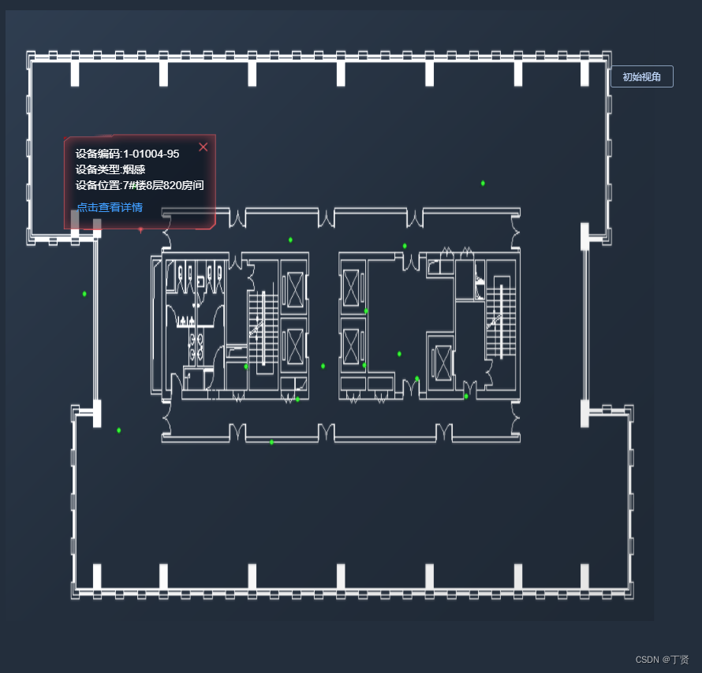
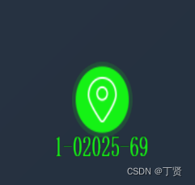
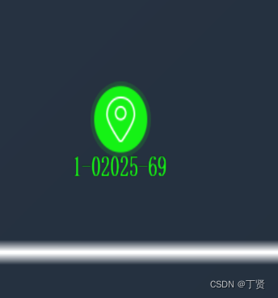

#### 先上效果图

  
点位放大如下  


#### 容器代码+信息窗口代码如下

```javascript
<div id="three-dx" style="width: 100%;height: 80vh;"></div>
<div id="WebGL-output">
  <div class="" id="lableItem">
      <div style="font-size: 14px;color: #fff;padding:15px;line-height:20px;background-repeat: no-repeat;
      background: url(image/dialog-Red.png);position:relative;background-size: 100% 100%;">
        </img>
        <div>设备编码:{{point.deviceCode||pointDetail.deviceName}}</div>
        <div>设备类型:{{point.type||pointDetail.deviceType}}</div>
        <div v-if="point.logicAddress">设备信息:{{point.logicAddress}}</div>
        <div>设备位置:{{point.address||pointDetail.address}}</div>
        <div v-if="point.installTime">设备时间:{{point.installTime}}</div>
        <el-button type="text" class="toPointDetail" @click="toPointDetail">点击查看详情</el-button>
      </div>
  </div>
</div>
```

本文使用的[threejs](https://so.csdn.net/so/search?q=threejs&spm=1001.2101.3001.7020)版本如下`"three": "^0.138.3","three-obj-mtl-loader": "^1.0.3","three-orbitcontrols": "^2.110.3",`不同版本可能会导致模块引入写法不一致，需注意。THREE.aaa报错的话，需要单独引入。

定义一些3维变量，例如场景/相机/控制器/灯光等等（此次建议写在外部，避免影响性能，造成页面卡顿），引入相关依赖文件。

```javascript
var scene,camera,renderer,controls,animate,light,animationFrame,dragControls,composer,outlinePass,
CSS2D,CSS2Dobj,raycaster,mouse,sprite,plane,building;//可能存在用不着的变量，可删除忽略
var objects = [];//可拖曳模型的数组
import * as THREE from 'three';
import { OBJLoader, MTLLoader } from 'three-obj-mtl-loader'//obj  mtl模型渲染器
import {FBXLoader} from 'three/examples/jsm/loaders/FBXLoader.js'//fbx模型渲染器
import { OrbitControls } from 'three/examples/jsm/controls/OrbitControls'//控制器
import { DragControls } from 'three/examples/jsm/controls/DragControls'// 拖拽控件
//呼吸灯相关
import {EffectComposer} from 'three/examples/jsm/postprocessing/EffectComposer.js'
import {OutlinePass} from 'three/examples/jsm/postprocessing/OutlinePass.js'
import {RenderPass} from 'three/examples/jsm/postprocessing/RenderPass.js'
import {ShaderPass} from 'three/examples/jsm/postprocessing/ShaderPass.js'
import {FXAAShader} from 'three/examples/jsm/shaders/FXAAShader.js'
//信息窗口 2D/3D 看具体使用情况
import {CSS2DRenderer,CSS2DObject} from "three/examples/jsm/renderers/CSS2DRenderer.js";
import {CSS3DRenderer,CSS3DObject,CSS3DSprite} from "three/examples/jsm/renderers/CSS3DRenderer.js";
//ajax
import { markPoint,getFloorPoints } from "@/api/building.js"
```

首先，页面挂载生命周期内执行初始化3d模型方法。init包含所有需要初始化的模块的方法。  
[animate](https://so.csdn.net/so/search?q=animate&spm=1001.2101.3001.7020)方法是模型每一帧的动画。  
业务需求，需要在[cad](https://so.csdn.net/so/search?q=cad&spm=1001.2101.3001.7020)图纸上实现标点/拖曳功能。大概思路为：把图纸png作为场景的平面图，固定俯视角度+不可旋转倾斜。插入的点位y坐标固定，永远位于图纸上面。点击点位获取3维坐标，改变信息窗口的位置并且展示。

```javascript
mounted() {
    this.init()
    this.animate()
},
```

```javascript
animate(){
  animationFrame = requestAnimationFrame(this.animate);
  CSS2D.render(scene, camera);//不写的话，信息窗口出不来
  renderer.render(scene, camera);
  controls.update();
  if (composer) {//呼吸灯相关，动画效果
    composer.render()
  }
},
init(){
  this.initScene();//初始化 场景
  this.initCamera();//初始化 相机--视角
  this.initRenderer();//初始化  渲染器
  this.initControls();//初始化  控制器
  this.initContent();//初始化  内容--模型
  this.initLight();//初始化  灯光
  this.initDragControls();//初始化  拖曳
  this.initCSS2DRenderer();//初始化  信息窗口

  raycaster = new THREE.Raycaster();//模型内实现点击功能相关模块

  window.addEventListener('resize', this.onWindowResize, false);//监听窗口大小变化，渲染更新
},
//具体内容如下
onWindowResize(){
  let dxBox = document.querySelector('#three-dx');
  camera.aspect = dxBox.offsetWidth / dxBox.offsetHeight;
  camera.updateProjectionMatrix();
  renderer.setSize(dxBox.offsetWidth, dxBox.offsetHeight);
},
initScene(){
 scene = new THREE.Scene()
},
initRenderer(){
  let dxBox = document.querySelector('#three-dx');
  renderer = new THREE.WebGLRenderer({antialias: true,alpha:true});
  renderer.setSize(dxBox.offsetWidth, dxBox.offsetHeight);
  dxBox.appendChild(renderer.domElement);
  renderer.domElement.addEventListener("click", this.onClick, false);//给3维场景添加点击事件
},
initControls(){
  controls = new OrbitControls(camera, renderer.domElement);
  controls.enableRotate = false;//禁止旋转
  controls.update();
},
initCamera(){
  camera = new THREE.PerspectiveCamera(45, window.innerWidth / window.innerHeight, 0.1, 10000);
  camera.position.set(0, 700, 0);//俯视角度
  camera.lookAt(new THREE.Vector3(0, 0, 0));
},
initLight(){
  light = new THREE.SpotLight(0xffffff);
  light.position.set(-300, 600, -400);
  scene.add(light);
  scene.add(new THREE.AmbientLight(0x5C5C5C));
},
initContent(){
  let fbxLoader = new FBXLoader();//该场景未使用到加载模型，可网上查询如何使用
  //fbx文件个人觉着比较轻量，不卡顿，不存在模型+贴纸的概念
  
  //此处为在线资源，可能存在跨域问题，需要nginx代理
  let mapUrl = this.baseUrl + this.floorMap;
  let map = new THREE.TextureLoader().load(mapUrl);
  // let map = new THREE.TextureLoader().load('./mode/pic2.png');//此处为本地资源
  let planeGeometry = new THREE.PlaneGeometry(800,600,1);//大小
  let planeMaterial = new THREE.MeshLambertMaterial({
    color:0xffffff,
    map:map
  });
  plane = new THREE.Mesh(planeGeometry,planeMaterial);
  plane.receiveShadow = true;
  plane.rotation.x = -0.5 * Math.PI;
  plane.position.x = 15;
  plane.position.y = 0;
  plane.position.z - 0;
  scene.add(plane);//添加到场景中
},
initDragControls(){// 初始化拖拽控件
//初始化完成后，只需要控制objects数组，就可以实现拖曳；
//注意：group类型拖曳最多一个，不然会出现bug。可以不使用Group或者改变Group里的内容，例如官方demo
//https://threejs.org/examples/?q=drag#misc_controls_drag
	let dxBox = document.querySelector('#three-dx');
	dragControls = new DragControls(objects, camera, renderer.domElement);
	// dragControls.transformGroup = true;//有bug
	dragControls.enabled = false;
	
	dragControls.addEventListener('drag',(event)=>{
	  renderer.render( scene, camera );
	});
	// 开始拖拽
	dragControls.addEventListener('dragstart', function (event) {
	    controls.enabled = false;
	});
	// 拖拽结束
	dragControls.addEventListener('dragend',  (event)=> {
	  // console.log(event.object,'objects')//模型信息
	  //自定义业务代码
	});
},
initCSS2DRenderer(){
  let contanier = document.querySelector('.dx-contanier');
  let dxBox = document.querySelector('#three-dx');
  CSS2D = new CSS2DRenderer();
  CSS2D.setSize(contanier.clientWidth, contanier.clientHeight);
  CSS2D.domElement.style.position = 'absolute';
  CSS2D.domElement.style.top = '0px';
  CSS2D.domElement.style.pointerEvents  = 'none';
  dxBox.appendChild(CSS2D.domElement);
  this.addCSS2DLabelToScene();

  let closeLogo = document.querySelector('.closeLogo');
  closeLogo.style.pointerEvents  = 'auto';
  let toPointDetail = document.querySelector('.toPointDetail');
  toPointDetail.style.pointerEvents  = 'auto';
},
addCSS2DLabelToScene(){
  let element = document.getElementById("WebGL-output"); //把生成的CSSDOM对象处理成three的节点对象

  CSS2Dobj = new CSS2DObject(element); //设置CSS2DObject对象
  // CSS2Dobj = new CSS3DSprite(element); //设置CSS3DObject对象
  scene.add(CSS2Dobj); //在第二个场景中添加这个对象
  CSS2Dobj.visible = false; // 默认不显示
},
```

#### 关于模型内的点击方法如下

```javascript
onClick(event){
//此处需要注意，有时候存在点击精度问题（点击不准），是因为在进行坐标转换的时候，容器大小没写对。
//网上大部分方案取的是整个窗口的宽度和高度来计算，如果你的场景也是满屏幕，可以这么写。如果你的3d场景是某一块盒子，就需要注意了。
  let dxBox = document.querySelector('#three-dx');
  let getBoundingClientRect = dxBox.getBoundingClientRect();
  mouse.x = ((event.clientX - getBoundingClientRect.left) / dxBox.offsetWidth) * 2 - 1;
  mouse.y = - ((event.clientY - getBoundingClientRect.top) / dxBox.offsetHeight) * 2 + 1;
  raycaster.setFromCamera( mouse, camera );
  var intersects = raycaster.intersectObjects( scene.children,true );

  if (intersects.length > 0) {
    // 处理点击事件
    const selected = intersects[0];// intersects[0] 包含了第一个交点
    // console.log(selected,'==selected==',this.idEdit,objects);
    let {x,y,z} = selected.point;//获取三维坐标
    //自定义业务
  }
},
```

这是点的样式。思路为：创建一个canvas，里面有图片+文字，位置大小调整好后，把canvas转成图，提供给SpriteMaterial使用  


#### 关于如何插点，代码如下。插多个点循环调用即可。

场景为：点击模型某处，获取3维坐标，调用该方法。回显已标记点位，循环点位列表，调用该方法。

```javascript
marker(x,y,z,point={}){//插入一个点
	let pointType = point.deviceType||this.point.type
	
	let canvas = document.createElement("canvas");
	canvas.width = 180;
	// canvas.height = 100;
	let ctx = canvas.getContext("2d");
	let img = new Image();
	img.src='./mode/正常图标/其他.png';
	img.onload = () => {
		ctx.drawImage(img,30,0,100,80);//绘画图片
		ctx.fillStyle = this.model == 'alarm'?"#F56C6C":"#15f215";
		ctx.font = "Bold 30px 宋体";
		let textKey = this.model == 'alarm'?this.point.deviceCode:point.deviceName
		ctx.fillText(textKey,0,100);
		
		let texture = new THREE.Texture(canvas);
		texture.needsUpdate = true;
		let material_text = new THREE.SpriteMaterial({map:texture});
		let text = new THREE.Sprite(material_text);
		text.name = 'marker'
		text.userData = point;//给点位辅助 自定义数据，后续点击点位，可以拿到这个点的数据信息
		text.scale.set(10,10,0);
		text.position.set(x,20,z);
		
		scene.add(text);
		objects.push(text);//添加至 可拖曳数组
	};
},
```

#### 信息窗口部分：全局只存在一个窗口，使用时，改变其3维坐标，控制显隐即可。

```javascript
CSS2Dobj.visible = false/true;
CSS2Dobj.position.x = x;
CSS2Dobj.position.y = 5;
CSS2Dobj.position.z = z-90;
```

CSS2Dobj/CSS3Dobj是存在区别的，3d会随着模型旋转一起转动，但是他不会随着模型的放大/缩小而变化，所以会导致模型缩小时，显的信息窗口特别大，3d里面自带点击事件，不用单独处理。2d大小固定，不管模型如何操作，2d窗口永远会对着屏幕并且大小不会改变。缺点是无法触发点击，需要单独处理。例如：点击信息窗口右上角X图标关闭，需要取它的dom，改变其pointerEvents为auto

```javascript
let closeLogo = document.querySelector('.closeLogo');
closeLogo.style.pointerEvents  = 'auto';
```

#### 关于 模型呼吸灯效果

```javascript
outlineObj(selectedObjects) { //高亮显示模型（呼吸灯）
  // 创建一个EffectComposer（效果组合器）对象，然后在该对象上添加后期处理通道。
  composer = new EffectComposer(renderer)
  // 新建一个场景通道  为了覆盖到原理来的场景上
  let renderPass = new RenderPass(scene, camera)
  composer.addPass(renderPass)
  // 物体边缘发光通道
  outlinePass = new OutlinePass(new THREE.Vector2(window.innerWidth, window.innerHeight),
  scene, camera,selectedObjects)

  outlinePass.edgeStrength = 3 // 高光边缘边框的亮度
  outlinePass.edgeGlow = 1 // 光晕[0,1]  边缘微光强度
  outlinePass.usePatternTexture = false // 是否使用父级的材质，纹理覆盖
  outlinePass.edgeThickness = 2 // 边框宽度，高光厚度
  outlinePass.downSampleRatio = 2 // 边框弯曲度
  outlinePass.pulsePeriod = 2 // 呼吸闪烁的速度，数值越大，律动越慢
  outlinePass.visibleEdgeColor.set(parseInt(0xfe0000)) // 呼吸显示的颜色
  outlinePass.hiddenEdgeColor = new THREE.Color(10, 10, 10) // 呼吸消失的颜色
  outlinePass.clear = true;
  composer.addPass(outlinePass) // 加入高光特效

  let effectFXAA = new ShaderPass(FXAAShader);
  effectFXAA.uniforms.resolution.value.set(1 / window.innerWidth, 1 / window.innerHeight);
  effectFXAA.renderToScreen = true;
  composer.addPass(effectFXAA);
},
```

#### 回到默认视角

一行代码即可controls.reset();

```javascript
backView(){
 controls.reset();
  composer = null;//高亮
  outlinePass = null;//呼吸灯
  CSS2Dobj.visible = false;
}
```

#### 删除所有点位 更换场景平面图

```javascript
for( var i = scene.children.length - 1; i >= 0; i--) {
      let item = scene.children[i];
      if(item.name == "marker"){
        scene.remove(item);
      }
}
```

```javascript
updateMap(){
  dragControls.dispose();
  objects = [];
  this.initDragControls();

  scene.remove(plane)//删除旧map
  let fbxLoader = new FBXLoader();
  let mapUrl = this.baseUrl + this.floorMap;
  let map = new THREE.TextureLoader().load(mapUrl);
  // let map = new THREE.TextureLoader().load('./mode/pic2.png');
  let planeGeometry = new THREE.PlaneGeometry(800,600,1);
  let planeMaterial = new THREE.MeshLambertMaterial({
    color:0xffffff,
    map:map
  });
  plane = new THREE.Mesh(planeGeometry,planeMaterial);
  plane.receiveShadow = true;
  plane.rotation.x = -0.5 * Math.PI;
  plane.position.x = 15;
  plane.position.y = 0;
  plane.position.z - 0;
  scene.add(plane);//添加到场景中
},
```